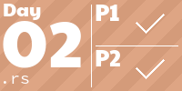
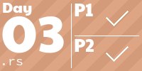
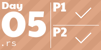
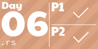
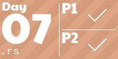
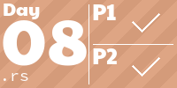
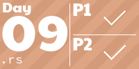
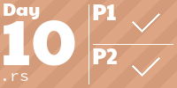
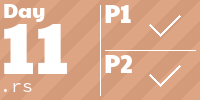
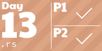

# [Advent of Code 2022](https://adventofcode.com/2022/about)
No particular challange done, though (at list at the beginning) I try to stick to rust.

Path to the input file should be passed as a first argument to the program.

### Progress
<!-- AOC TILES BEGIN -->
<h1 align="center">
  26 ⭐
</h1>

<!-- AOC TILES END -->
